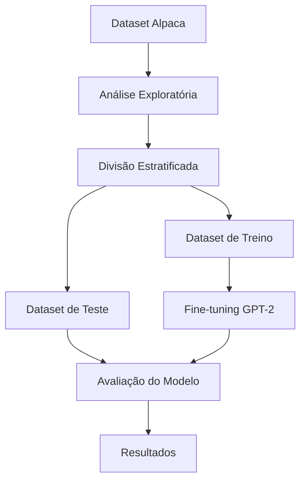

# Fine-tuning do GPT-2 com Dataset Alpaca

[](https://www.python.org/downloads/release/python-3120/)
[](https://pytorch.org/)
[](https://huggingface.co/docs/transformers/index)
[](https://huggingface.co/docs/datasets/index)
[](https://plotly.com/python/)
[](https://dash.plotly.com/)

## 📊 Fluxo do Projeto



## 📁 Estrutura do Projeto

```
gpt2_finetuning/
├── data/                    # Dados e scripts de processamento
│   ├── train_dataset.parquet    # Dataset de treino
│   └── test_dataset.parquet     # Dataset de teste
├── eda/                    # Análise Exploratória de Dados
│   ├── analyze_fulldataset.py   # Script de análise
│   └── stats/                   # Resultados das análises
├── src/                    # Código fonte
│   ├── data/                   # Processamento de dados
│   ├── model/                  # Modelo e treinamento
│   └── utils/                  # Utilitários
├── requirements.txt        # Dependências do projeto
└── README.md              # Documentação
```

## 📊 Estatísticas do Dataset

### Dataset Original
- **Total de Exemplos**: ~52,000
- **Exemplos com Input**: ~40% (20,800)
- **Exemplos sem Input**: ~60% (31,200)

### Datasets de Treino e Teste
- **Treino**: 3,000 exemplos
- **Teste**: 3,000 exemplos
- **Total**: 6,000 exemplos (~11.5% do original)

## 🛠️ Instalação

1. Instale o gerenciador de pacotes `uv`:
```bash
curl -LsSf https://astral.sh/uv/install.sh | sh
```

2. Compile as dependências:
```bash
uv pip compile pyproject.toml -o requirements.txt
```

3. Instale as dependências:
```bash
uv pip install -r requirements.txt
```

## 🔬 Metodologia de Amostragem

A divisão do dataset foi realizada utilizando uma abordagem estratificada para garantir a representatividade das amostras. O processo foi implementado no script `analyze_fulldataset.py` e segue as seguintes etapas:

### 1. Preparação dos Dados
- Carregamento do dataset Alpaca completo (~52,000 exemplos)
- Criação de colunas auxiliares para estratificação:
  - `instruction_length`: Comprimento em caracteres de cada instrução
  - `has_input`: Flag booleana indicando presença de input adicional
  - `length_cat`: Categorização do comprimento em quartis (Q1, Q2, Q3, Q4)

### 2. Estratificação
A amostragem foi realizada considerando dois critérios principais:

#### 2.1 Comprimento das Instruções
- Divisão do dataset em quartis baseado no comprimento das instruções:
  - Q1: 0-25% (instruções mais curtas)
  - Q2: 25-50%
  - Q3: 50-75%
  - Q4: 75-100% (instruções mais longas)
- Objetivo: Garantir representatividade de instruções de diferentes tamanhos

#### 2.2 Presença de Input
- Estratificação baseada na presença/ausência de input adicional:
  - ~40% dos exemplos com input
  - ~60% dos exemplos sem input
- Objetivo: Manter a proporção original do dataset

### 3. Implementação Técnica
- Utilização do `train_test_split` do scikit-learn com:
  - `test_size=3000`
  - `train_size=3000`
  - `random_state=42` (para reprodutibilidade)
  - `stratify=[length_cat, has_input]` (estratificação múltipla)

### 4. Validação da Amostragem
- Verificação das proporções em cada quartil
- Confirmação da distribuição de exemplos com/sem input
- Análise estatística comparativa entre dataset original e amostras

## 🤖 Execução do Modelo

O processo de geração de respostas foi implementado no script `task_one/run_instructions.py` e segue as seguintes etapas:

### 1. Configuração do Modelo
- Utilização do modelo GPT-2 small (ComCom/gpt2-small)
- Configuração do pipeline de geração de texto com:
  - `max_length=200` (limite de tokens por resposta)
  - `temperature=0.7` (controle de criatividade)
  - `top_p=0.9` (nucleus sampling)
  - `truncation=True` (truncamento explícito)
  - Suporte automático para GPU quando disponível

### 2. Processamento das Instruções
- Carregamento do dataset de teste (3,000 exemplos)
- Geração de resposta para cada instrução
- Armazenamento dos resultados em formato estruturado:
  - Instrução original
  - Input (quando presente)
  - Output original
  - Output gerado
  - Índice do exemplo

### 3. Salvamento dos Resultados
- Criação de diretório `results` para armazenamento
- Salvamento parcial a cada 100 exemplos (medida de segurança)
- Geração de arquivo final com timestamp
- Formato JSON com indentação para legibilidade

**OBS**: O salvamento parcial a cada 100 exemplos foi implementado como medida de segurança para:
- Evitar perda de dados em caso de interrupção
- Permitir monitoramento do progresso
- Facilitar a retomada do processo se necessário

## 📊 Análise Exploratória

O script `analyze_fulldataset.py` realiza uma análise completa do dataset, incluindo:

1. **Estatísticas de Comprimento**:
   - Média, mediana, desvio padrão
   - Mínimo e máximo
   - Para instruções, outputs e inputs

2. **Análise de Inputs**:
   - Total de exemplos
   - Proporção com/sem input
   - Percentual de exemplos com input

3. **Análise de Instruções**:
   - Top 5 verbos mais frequentes
   - Distribuição por tipo de instrução

4. **Análise de Legibilidade**:
   - Índice Flesch Reading Ease
   - Estatísticas de legibilidade

5. **Análise de Tópicos**:
   - Identificação de 5 tópicos principais
   - Palavras mais relevantes por tópico

## 📚 Referências

- [Dataset Alpaca](https://huggingface.co/datasets/tatsu-lab/alpaca)
- [Documentação do GPT-2](https://huggingface.co/docs/transformers/model_doc/gpt2)
- [Flesch, R. (1948). A new readability yardstick. Journal of Applied Psychology, 32(3), 221-233.](https://psycnet.apa.org/record/1948-05052-001)
