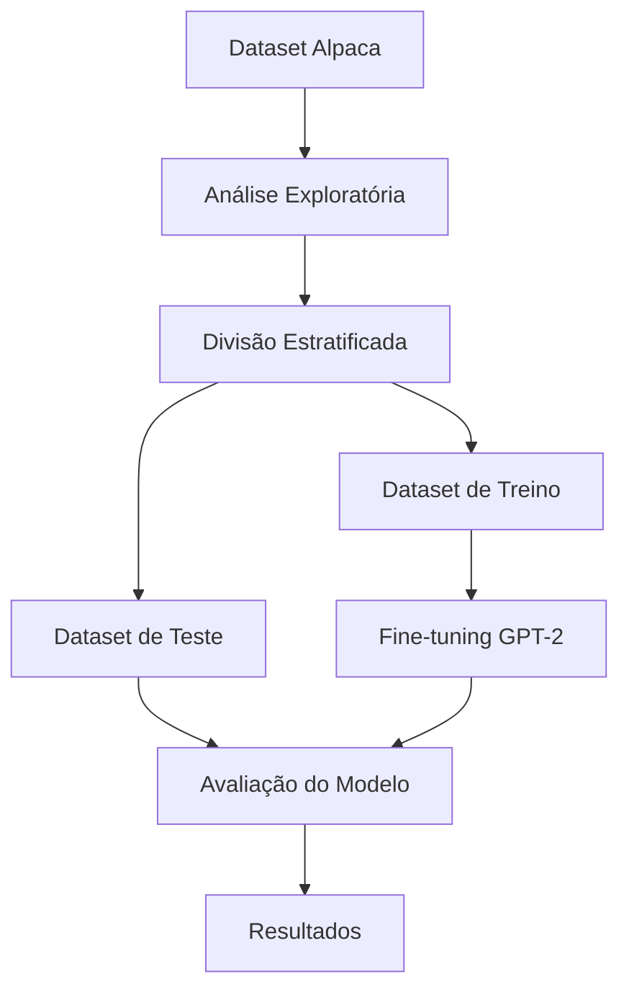

# Fine-tuning do GPT-2 com Dataset Alpaca

[](https://www.python.org/downloads/release/python-3120/)
[](https://pytorch.org/)
[](https://huggingface.co/docs/transformers/index)
[](https://huggingface.co/docs/datasets/index)
[](https://plotly.com/python/)
[](https://dash.plotly.com/)

## 📊 Fluxo do Projeto



## 📁 Estrutura do Projeto

```
gpt2_finetuning/
├── data/                    # Dados e scripts de processamento
│   ├── train_dataset.parquet    # Dataset de treino
│   └── test_dataset.parquet     # Dataset de teste
├── eda/                    # Análise Exploratória de Dados
│   ├── analyze_fulldataset.py   # Script de análise
│   └── stats/                   # Resultados das análises
├── src/                    # Código fonte
│   ├── data/                   # Processamento de dados
│   ├── model/                  # Modelo e treinamento
│   └── utils/                  # Utilitários
├── requirements.txt        # Dependências do projeto
└── README.md              # Documentação
```

## 📊 Estatísticas do Dataset

### Dataset Original
- **Total de Exemplos**: ~52,000
- **Exemplos com Input**: ~40% (20,800)
- **Exemplos sem Input**: ~60% (31,200)

### Datasets de Treino e Teste
- **Treino**: 3,000 exemplos
- **Teste**: 3,000 exemplos
- **Total**: 6,000 exemplos (~11.5% do original)

## 🛠️ Instalação

1. Instale o gerenciador de pacotes `uv`:
```bash
curl -LsSf https://astral.sh/uv/install.sh | sh
```

2. Compile as dependências:
```bash
uv pip compile pyproject.toml -o requirements.txt
```

3. Instale as dependências:
```bash
uv pip install -r requirements.txt
```

## 🔬 Metodologia de Amostragem

O dataset Alpaca original contém aproximadamente 52,000 exemplos. Para garantir uma avaliação robusta do modelo, realizei uma amostragem estratificada considerando dois aspectos principais:

1. **Comprimento das Instruções**: Dividi as instruções em quartis para garantir uma distribuição uniforme de exemplos curtos, médios e longos. Isso é crucial porque diferentes comprimentos de instrução podem exigir diferentes capacidades do modelo.

2. **Presença de Input Adicional**: Estratifiquei também com base na presença ou ausência de input adicional, mantendo a proporção original do dataset. Isso é importante porque exemplos com input adicional geralmente requerem um processamento diferente do modelo.

Optei por uma amostra de 3,000 exemplos para treinamento e 3,000 para teste (totalizando 6,000 exemplos, aproximadamente 11.5% do dataset original) por algumas razões:

- O dataset Alpaca contém uma grande variedade de tipos de instruções (perguntas factuais, solicitações criativas, tarefas de raciocínio, etc.)
- Se eu usasse amostragem aleatória simples, correria o risco de ter sub-representação ou sobre-representação de certos tipos de instruções
- Isso poderia levar a avaliações enviesadas do desempenho do modelo
- Com a estratificação, garanto que o modelo será testado em uma amostra representativa de todos os tipos de instruções

A implementação técnica foi feita usando o `train_test_split` do scikit-learn, aplicando a estratificação nas características mencionadas. Isso garante que tanto o conjunto de treinamento quanto o de teste mantenham as mesmas proporções do dataset original em relação a essas características.

## 🤖 Execução do Modelo

O processo de geração de respostas foi implementado no script `task_one/run_instructions.py` e segue as seguintes etapas:

### 1. Configuração do Modelo
- Utilização do modelo GPT-2 small (ComCom/gpt2-small)
- Configuração do pipeline de geração de texto com:
  - `max_length=200` (limite de tokens por resposta)
  - `temperature=0.7` (controle de criatividade)
  - `top_p=0.9` (nucleus sampling)
  - `truncation=True` (truncamento explícito)
  - Suporte automático para GPU quando disponível

### 2. Processamento das Instruções
- Carregamento do dataset de teste (3,000 exemplos)
- Geração de resposta para cada instrução
- Armazenamento dos resultados em formato estruturado:
  - Instrução original
  - Input (quando presente)
  - Output original
  - Output gerado
  - Índice do exemplo

### 3. Salvamento dos Resultados
- Criação de diretório `results` para armazenamento
- Salvamento parcial a cada 100 exemplos (medida de segurança)
- Geração de arquivo final com timestamp
- Formato JSON com indentação para legibilidade

**OBS**: O salvamento parcial a cada 100 exemplos foi implementado como medida de segurança para:
- Evitar perda de dados em caso de interrupção
- Permitir monitoramento do progresso
- Facilitar a retomada do processo se necessário

## 📈 Avaliação dos Resultados

Para avaliar a qualidade das respostas geradas pelo modelo, utilizei um conjunto abrangente de métricas implementadas no script `task_one/evaluation/evaluate_responses.py`. A avaliação foi realizada comparando as respostas geradas com as respostas originais do dataset Alpaca.

### Métricas Utilizadas

1. **BLEU Score**
   - Mede a similaridade entre a resposta gerada e a resposta original
   - Pontuação de 0 a 1, onde valores mais altos indicam maior similaridade
   - Interpretação:
     - BOM (≥ 0.6): Alta similaridade com a resposta original
     - MÉDIO (≥ 0.3): Similaridade moderada
     - RUIM (< 0.3): Baixa similaridade

2. **ROUGE Scores**
   - Avalia a sobreposição de palavras e sequências entre as respostas
   - Métricas calculadas:
     - ROUGE-1: Sobreposição de palavras únicas
     - ROUGE-2: Sobreposição de pares de palavras
     - ROUGE-L: Sobreposição de sequências mais longas
   - Interpretação:
     - BOM (≥ 0.7): Alta sobreposição
     - MÉDIO (≥ 0.4): Sobreposição moderada
     - RUIM (< 0.4): Baixa sobreposição

3. **Cosine Similarity**
   - Mede a similaridade semântica entre os embeddings das respostas
   - Utiliza o modelo de embeddings do spaCy para representação vetorial
   - Interpretação:
     - BOM (≥ 0.8): Alta similaridade semântica
     - MÉDIO (≥ 0.5): Similaridade moderada
     - RUIM (< 0.5): Baixa similaridade

4. **Análise de Comprimento**
   - Compara o comprimento das respostas geradas com as originais
   - Calcula a razão entre comprimentos (gerado/original)
   - Interpretação:
     - BOM (0.8-1.2): Comprimento similar ao original
     - MÉDIO (0.5-1.5): Comprimento moderadamente diferente
     - RUIM (< 0.5 ou > 1.5): Comprimento muito diferente

### Resultados Obtidos

Os resultados da avaliação foram salvos em formato JSON no diretório `task_one/evaluation/results/`. O relatório inclui:

- Estatísticas descritivas para cada métrica
- Distribuição das pontuações
- Análise qualitativa baseada nos critérios de interpretação
- Exemplos de respostas com diferentes níveis de qualidade

A análise detalhada dos resultados será incluída após a execução completa do processo de avaliação.

## 📊 Análise Exploratória

O script `analyze_fulldataset.py` realiza uma análise completa do dataset, incluindo:

1. **Estatísticas de Comprimento**:
   - Média, mediana, desvio padrão
   - Mínimo e máximo
   - Para instruções, outputs e inputs

2. **Análise de Inputs**:
   - Total de exemplos
   - Proporção com/sem input
   - Percentual de exemplos com input

3. **Análise de Instruções**:
   - Top 5 verbos mais frequentes
   - Distribuição por tipo de instrução

4. **Análise de Legibilidade**:
   - Índice Flesch Reading Ease
   - Estatísticas de legibilidade

5. **Análise de Tópicos**:
   - Identificação de 5 tópicos principais
   - Palavras mais relevantes por tópico

## 📚 Referências

- [Dataset Alpaca](https://huggingface.co/datasets/tatsu-lab/alpaca)
- [Documentação do GPT-2](https://huggingface.co/docs/transformers/model_doc/gpt2)
- [Flesch, R. (1948). A new readability yardstick. Journal of Applied Psychology, 32(3), 221-233.](https://psycnet.apa.org/record/1948-05052-001)
