# Fine-tuning do GPT-2 com Dataset Alpaca

[](https://www.python.org/downloads/release/python-3120/)
[](https://pytorch.org/)
[](https://huggingface.co/docs/transformers/index)
[](https://huggingface.co/docs/datasets/index)
[](https://plotly.com/python/)
[](https://dash.plotly.com/)

## 📊 Fluxo do Projeto

```mermaid
graph TD
    A[Dataset Alpaca] --> B[Análise Exploratória]
    B --> C[Divisão Estratificada]
    C --> D[Dataset de Treino]
    C --> E[Dataset de Teste]
    D --> F[Fine-tuning GPT-2]
    E --> G[Avaliação do Modelo]
    F --> G
    G --> H[Resultados]
```



## 📁 Estrutura do Projeto

```
gpt2_finetuning/
├── data/                    # Dados e scripts de processamento
│   ├── train_dataset.parquet    # Dataset de treino
│   └── test_dataset.parquet     # Dataset de teste
├── eda/                    # Análise Exploratória de Dados
│   ├── analyze_fulldataset.py   # Script de análise
│   └── stats/                   # Resultados das análises
├── src/                    # Código fonte
│   ├── data/                   # Processamento de dados
│   ├── model/                  # Modelo e treinamento
│   └── utils/                  # Utilitários
├── requirements.txt        # Dependências do projeto
└── README.md              # Documentação
```

## 📊 Estatísticas do Dataset

### Dataset Original
- **Total de Exemplos**: ~52,000
- **Exemplos com Input**: ~40% (20,800)
- **Exemplos sem Input**: ~60% (31,200)

### Datasets de Treino e Teste
- **Treino**: 3,000 exemplos
- **Teste**: 3,000 exemplos
- **Total**: 6,000 exemplos (~11.5% do original)

## 🛠️ Instalação

1. Instale o gerenciador de pacotes `uv`:
```bash
curl -LsSf https://astral.sh/uv/install.sh | sh
```

2. Compile as dependências:
```bash
uv pip compile pyproject.toml -o requirements.txt
```

3. Instale as dependências:
```bash
uv pip install -r requirements.txt
```

## 🔬 Metodologia de Amostragem

A divisão do dataset foi realizada utilizando uma abordagem estratificada para garantir a representatividade das amostras. Os critérios de estratificação foram:

1. **Comprimento das Instruções**:
   - Divisão em quartis (Q1, Q2, Q3, Q4)
   - Garante distribuição uniforme de instruções curtas e longas
   - Preserva a variabilidade natural do dataset

2. **Presença de Input Adicional**:
   - Estratificação baseada na presença/ausência de input
   - Mantém a proporção original (~40% com input, ~60% sem input)
   - Garante representatividade de ambos os tipos de exemplos

3. **Tamanho das Amostras**:
   - 3,000 exemplos para treino
   - 3,000 exemplos para teste
   - Total de 6,000 exemplos (~11.5% do dataset original)

4. **Implementação Técnica**:
   - Utilização do `train_test_split` do scikit-learn
   - Estratificação baseada em múltiplas características
   - Semente aleatória fixa (random_state=42) para reprodutibilidade

## 📊 Análise Exploratória

O script `analyze_fulldataset.py` realiza uma análise completa do dataset, incluindo:

1. **Estatísticas de Comprimento**:
   - Média, mediana, desvio padrão
   - Mínimo e máximo
   - Para instruções, outputs e inputs

2. **Análise de Inputs**:
   - Total de exemplos
   - Proporção com/sem input
   - Percentual de exemplos com input

3. **Análise de Instruções**:
   - Top 5 verbos mais frequentes
   - Distribuição por tipo de instrução

4. **Análise de Legibilidade**:
   - Índice Flesch Reading Ease
   - Estatísticas de legibilidade

5. **Análise de Tópicos**:
   - Identificação de 5 tópicos principais
   - Palavras mais relevantes por tópico

## 📚 Referências

- [Dataset Alpaca](https://huggingface.co/datasets/tatsu-lab/alpaca)
- [Documentação do GPT-2](https://huggingface.co/docs/transformers/model_doc/gpt2)
- [Flesch, R. (1948). A new readability yardstick. Journal of Applied Psychology, 32(3), 221-233.](https://psycnet.apa.org/record/1948-05052-001)
